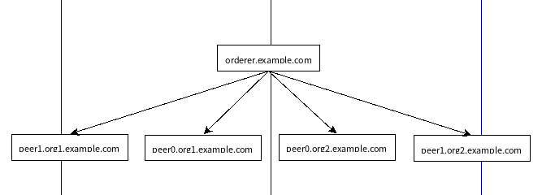

# 网络拓扑



# 如果需要安装docker 环境

相关网址如下：

- [Docker安装官方指导教程](https://docs.docker.com/install/#reporting-security-issues) 

# 如果需要安装Go、Fabric环境

**Peer节点需要安装链码，以及执行一些其他操作，最好安装go及Fabric环境**

1.将本地下载好的go语言安装包上传至远程服务器
```bash
- 如果是peer0org1节点:
scp ./go1.11.linux-amd64.tar.gz  root@45.63.14.242:/usr/local/src

- 如果是peer0org2节点:
scp ./go1.11.linux-amd64.tar.gz  root@45.77.200.129:/usr/local/src

```
2.将本地下载好的Fabric安装包上传至远程服务器
```bash
首先在远程服务器上创建Fabric工作目录:

- 如果是peer0org1:
ssh root@45.63.14.242 "mkdir -p /home/gopath/src/github.com/hyperledger"

- 如果是peer0org2:
ssh root@45.77.200.129 "mkdir -p /home/gopath/src/github.com/hyperledger"


git clone https://github.com/hyperledger/fabric.git  
或者 
- 如果是peer0org1:
scp ./fabric-release-1.4.zip  root@45.63.14.242:/home/gopath/src/github.com/hyperledger

- 如果是peer0org2:
scp ./fabric-release-1.4.zip  root@45.77.200.129:/home/gopath/src/github.com/hyperledger

```

3.配置环境变量

记得将该压缩包解压到该路径下，并重命名：
```bash
- 如果是peer0org1:
ssh root@45.63.14.242

安装需要使用的工具包:
yum install gcc unzip git vim

解压go语言安装包:
cd /usr/local/src
tar -zxf go1.11.linux-amd64.tar.gz

cd /home/gopath/src/github.com/hyperledger
unzip fabric-release-1.4.zip
mv fabric-release-1.4 fabric


vim /etc/profile

export GOROOT="/usr/local/src/go"
export GOPATH="/home/gopath"
export GOBIN=$GOROOT/bin
export FABRIC_BIN="/home/gopath/src/github.com/hyperledger/fabric/release/linux-amd64/bin"
export PATH=$PATH:$GOROOT:$GOPATH:$GOBIN:$FABRIC_BIN

source /etc/profile

```
4.编译fabric
```bash
cd /home/gopath/src/github.com/hyperledger/fabric
make release
```

# orderer节点部署

1.配置环境

包括了docker、docker-compose环境

2.登录远程主机
```bash
ssh root@207.246.88.170 
```

3.创建远程主机工作目录
```bash
在远程服务器上创建目录:
mkdir -p /home/gopath/src/github.com/hyperledgerFabricCluster/fixtures
mkdir -p /home/gopath/src/github.com/hyperledgerFabricCluster/fixtures/crypto-config
mkdir -p /home/gopath/src/github.com/hyperledgerFabricCluster/fixtures/channel-artifacts
```

4.复制文件到远程工作目录中
```bash

scp ./docker-orderer.yaml root@207.246.88.170:/home/gopath/src/github.com/hyperledgerFabricCluster/fixtures
scp -r ../crypto-config/ordererOrganizations root@207.246.88.170:/home/gopath/src/github.com/hyperledgerFabricCluster/fixtures/crypto-config
scp ../channel-artifacts/genesis.block root@207.246.88.170:/home/gopath/src/github.com/hyperledgerFabricCluster/fixtures/channel-artifacts
```

5.进入远程服务器，并启动orderer节点（仅仅测试）
```bash
cd /home/gopath/src/github.com/hyperledgerFabricCluster/fixtures

docker-compose -f docker-orderer.yaml up -d
```


执行这个命令之后，将会下载latest版本的orderer镜像，通过docker ps 命令可查看，但我需要安装1.4.0的镜像，所以需要从仓库拉去指定版本的orderer镜像。
```bash
docker pull  hyperledger/fabric-orderer:1.4.0
```

6.其他

关闭节点网络
```bash
docker-compose -f docker-orderer.yaml down
```
查看容器日志
```bash
docker logs orderer.example.com
```

# peer0org1节点部署

1.配置环境

包括了docker、docker-compose、Go、Fabric环境

2.登录远程主机
```bash
ssh root@45.63.14.242
```
3.创建远程主机工作目录
```bash
在远程服务器上创建目录:
mkdir -p /home/gopath/src/github.com/hyperledgerFabricCluster/fixtures
mkdir -p /home/gopath/src/github.com/hyperledgerFabricCluster/fixtures/crypto-config/peerOrganizations
mkdir -p /home/gopath/src/github.com/hyperledgerFabricCluster/fixtures/channel-artifacts
mkdir -p /home/gopath/src/github.com/hyperledgerFabricCluster/fixtures/chaincode

```

4.复制文件到远程工作目录中
```bash
记得首先修改docker-peer0org1.yaml中ca容器的--ca.keyfile的值为真实的org1.example.com的私钥
scp ./docker-peer0org1.yaml root@45.63.14.242:/home/gopath/src/github.com/hyperledgerFabricCluster/fixtures

scp -r ../crypto-config/peerOrganizations/org1.example.com root@45.63.14.242:/home/gopath/src/github.com/hyperledgerFabricCluster/fixtures/crypto-config/peerOrganizations
scp ../channel-artifacts/mychannel.tx root@45.63.14.242:/home/gopath/src/github.com/hyperledgerFabricCluster/fixtures/channel-artifacts
scp ../channel-artifacts/Org1MSPanchors.tx root@45.63.14.242:/home/gopath/src/github.com/hyperledgerFabricCluster/fixtures/channel-artifacts
在实例化链码时需要引用orderer证书:
scp -r ../crypto-config/ordererOrganizations root@45.63.14.242:/home/gopath/src/github.com/hyperledgerFabricCluster/fixtures/crypto-config/
在本地上传文件至远程服务器:
scp ../chaincode/chaincode_example02.go root@45.63.14.242:/home/gopath/src/github.com/hyperledgerFabricCluster/fixtures/chaincode
```
5.启动peer0org1节点（仅仅测试）
```bash
cd /home/gopath/src/github.com/hyperledgerFabricCluster/fixtures

docker-compose -f docker-peer0org1.yaml up -d
```
执行这个命令之后，将会下载latest版本的peer镜像，通过docker ps 命令可查看，但我需要安装1.4.0的镜像，所以需要从仓库拉去指定版本的peer镜像。
```bash
docker pull  hyperledger/fabric-peer:1.4.0
```

关闭peer0org1节点(配置fabric环境之前要关闭网络，否则，make release会失败)
```bash
docker-compose -f docker-peer0org1.yaml down
```

# peer0org2节点部署

1.配置环境

包括了docker、docker-compose、Go、Fabric环境

2.登录远程主机
```bash
ssh root@45.77.200.129
```
3.创建远程主机工作目录
```bash
在远程服务器上创建目录:
mkdir -p /home/gopath/src/github.com/hyperledgerFabricCluster/fixtures
mkdir -p /home/gopath/src/github.com/hyperledgerFabricCluster/fixtures/crypto-config/peerOrganizations
mkdir -p /home/gopath/src/github.com/hyperledgerFabricCluster/fixtures/channel-artifacts
mkdir -p /home/gopath/src/github.com/hyperledgerFabricCluster/fixtures/chaincode

```

4.复制文件到远程工作目录中
```bash
记得首先修改docker-peer0org2.yaml中ca容器的--ca.keyfile的值为真实的org2.example.com的私钥
scp ./docker-peer0org2.yaml root@45.77.200.129:/home/gopath/src/github.com/hyperledgerFabricCluster/fixtures

scp -r ../crypto-config/peerOrganizations/org2.example.com root@45.77.200.129:/home/gopath/src/github.com/hyperledgerFabricCluster/fixtures/crypto-config/peerOrganizations
scp ../channel-artifacts/mychannel.tx root@45.77.200.129:/home/gopath/src/github.com/hyperledgerFabricCluster/fixtures/channel-artifacts
scp ../channel-artifacts/Org2MSPanchors.tx root@45.77.200.129:/home/gopath/src/github.com/hyperledgerFabricCluster/fixtures/channel-artifacts
在实例化链码时需要引用orderer证书:
scp -r ../crypto-config/ordererOrganizations root@45.77.200.129:/home/gopath/src/github.com/hyperledgerFabricCluster/fixtures/crypto-config/
在本地上传文件至远程服务器:
scp ../chaincode/chaincode_example02.go root@45.77.200.129:/home/gopath/src/github.com/hyperledgerFabricCluster/fixtures/chaincode
```
5.启动peer0org2节点（仅仅测试）
```bash
cd /home/gopath/src/github.com/hyperledgerFabricCluster/fixtures

docker-compose -f docker-peer0org2.yaml up -d
```
执行这个命令之后，将会下载latest版本的peer镜像，通过docker ps 命令可查看，但我需要安装1.4.0的镜像，所以需要从仓库拉去指定版本的peer镜像。
```bash
docker pull  hyperledger/fabric-peer:1.4.0
```

关闭peer0org1节点(配置fabric环境之前要关闭网络，否则，make release会失败)
```bash
docker-compose -f docker-peer0org2.yaml down
```